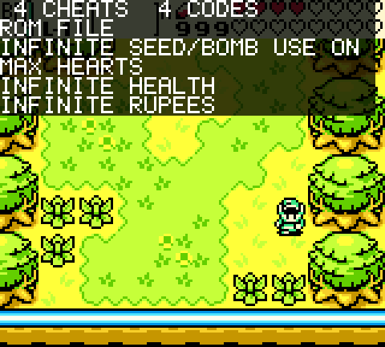
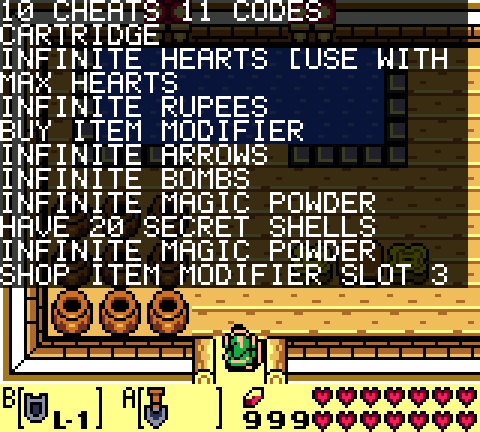

# Cheats on the Pocket GB/GBC core

Game Genie and GameShark codes, read straight from libretro `.cht` files. Which
cheats are on is decided by the file; the core menu has a single global switch.
Works with ROMs on the SD card and with a physical cartridge.

## Quick start

1. Put the `.cht` next to the ROM, named after the **whole** ROM filename with
   `.cht` appended:
   `/Assets/gbc/common/Zelda.gbc` -> `/Assets/gbc/common/Zelda.gbc.cht`.
   That is APF's rule for a slot whose filename is cloned from slot 0 (the
   extension is appended, not swapped).

   The file is plain text and you write it by hand. Only keys ending `_code`,
   `_desc` and `_enable` are read; `_code` and `_desc` take a quoted value,
   `_enable` a bare `true` or `false`. Everything else is ignored, including
   `cheats = N` and the number in `cheatN_`: cheats are taken in file order,
   and each `_code` starts a new one.

   ```
   cheat0_desc = "Infinite Hearts (3)"
   cheat0_code = "010CAAC6"
   cheat0_enable = true
   ```

   Only the `_code` line is required; the sections below are the full format.

   Watch the extension. Windows hides known ones, so a file saved from Notepad
   as `Zelda.gbc.cht` may really be `Zelda.gbc.cht.txt`: turn on "File name
   extensions" in Explorer's View tab. On macOS, TextEdit writes rich text
   unless you pick Format > Make Plain Text first. **Show cheats** says NO
   CHEATS LOADED when the file was never found, which is what either mistake
   looks like.

   The UI side lives in a separate repo,
   [openfpga-GBC-cheats-ui](https://github.com/kroy-the-rabbit/openfpga-GBC-cheats-ui):
   a desktop picker that matches ROMs on the card against the cheat database and
   writes these files. Nothing here depends on it, and none of it lives here.

2. Load the game, open the core menu and tick **Show cheats**. The names of the
   cheats that are on appear over the picture, above a count of what was parsed
   and whether this game came from a cartridge or a file. A file that never
   loaded says NO CHEATS LOADED.
3. **Cheats enabled** turns the whole lot on and off, and it is **off at every
   launch**. Nothing is patched or written until you switch it on, and the core
   forgets that you did as soon as the session ends, so no game ever starts with
   cheats live because of something you did days ago. The file next to the ROM
   still decides *which* cheats are on; this decides whether any of them run.

Nothing has to be converted or precompiled. The core parses the ASCII itself.

## Which cheats are on

Each cheat in the file carries an enable flag, exactly as libretro writes it:

```
cheat0_desc = "Infinite Health"
cheat0_code = "0140AAC6"
cheat0_enable = true
```

* `true` or `1` means on, anything else means off.
* A cheat with **no** enable key at all defaults to on, so a hand-written file
  that lists nothing but codes works.
* Stock files from the libretro database ship with every cheat set to `false`,
  which is why dropping one in unedited does nothing until you turn some on.
  Write a file with just the cheats you want, enabled, rather than editing a
  stock one.
* One libretro cheat can hold several codes joined with `+`; they are one cheat
  and share one flag.
* Cheats whose codes contain `XX`/`YY` placeholders are not valid hex, so the
  core drops them.

The core menu deliberately has no per-cheat checkboxes. APF menu labels are
fixed in JSON and cannot be changed by the core at runtime, so they could only
ever read "Cheat 1", "Cheat 2"; the file says it better.

Limits: 32 cheats and 32 codes per file, and 1 MB of file.

## Supported code formats

| Form | Example | Meaning |
|---|---|---|
| GameShark, 8 digits | `010CAAC6` | value `0C` at `$C6AA` (address is little endian) |
| Game Genie, 9 digits | `002-46F-E69` | value with a compare byte |
| Game Genie, 6 digits | `1EC-86B` | value, no compare byte |

Hyphens are decoration and ignored. Game Genie decoding follows SameBoy's
`Core/cheats.c`; `tools/cheats/ggdecode.py` is the same algorithm in Python and
is used to check the RTL.

The two formats are handled differently, because they are different things.

A **Game Genie** code patches ROM, so the core overrides the CPU's read: when
the CPU fetches a patched address it sees the cheat value instead. That is
exactly what the cartridge did.

A **GameShark** code is a RAM write, and overriding the read only approximates
it. The approximation holds for the common case, a counter the game reads back
and draws, and breaks wherever the value is reached some other way: a DMA copy,
a routine that caches it once, or a read-modify-write whose result is stored and
then re-faked on the next read. The value is never actually in memory, which is
not what the codes were written against. So the core writes it instead, once per
frame at vblank, exactly as the cartridge did. `src/gb/cheat_poker.sv` does the
writing, through the second port of the work RAM and high RAM blocks.

Confirmed on hardware: GameShark codes take effect as writes on a real Pocket,
on the GBC core, with a real file next to the ROM on the SD card and with a
real cartridge in the slot.

Be clear about what that does *not* fix. A cheat that misbehaves because its
value is wrong for your save misbehaves either way. Oracle of Ages painting
sixteen hearts across the HUD is the stock "Infinite Hearts (Max)" code writing
`0x40` to `$C6AA`, sixty-four quarter hearts; the game does not clamp it, and a
poke of `0x40` draws the same sixteen hearts a faked read does. The fix there is
`010CAAC6` (three hearts) or the Game Genie code `006-EFB-3BE`, which patches
the damage path and does not care how many containers you have.

The poker reaches `$C000-$DFFF` (work RAM) and `$FF80-$FFFE` (high RAM). A
GameShark code's type byte is honoured: `01` means any bank, anything else names
a work RAM bank in its low nibble, and such a code applies only while SVBK has
that bank mapped. Without that check a code aimed at `$D000-$DFFF` would land in
whichever bank happened to be selected at vblank, which is a different variable
somewhere else in the game. 362 codes in the database name a bank. A GameShark code pointed anywhere else,
cart RAM most often, stays on the read override, so nothing that used to work
stopped. Between them that covers every code in the sample files: 23 GameShark
codes in work RAM, 11 Game Genie codes in ROM.

The savestate engine owns the same RAM port and always wins it. A frame the
poker loses costs nothing, because the identical write happens on the next one.

The override only stands in for a byte the cartridge would have supplied. Two
higher-priority sources in the CPU's read mux are not the cartridge and are
never patched: the interrupt vector, and the internal boot ROM, which occupies
the same low addresses Game Genie codes use. Patching either is how an
unconditional code stops the machine booting at all.

## Cartridges

Cheats work on a real cartridge. The override lands on the CPU's data input
inside `gb.v`, downstream of the physical/backend cartridge mux in
`core_top.sv`, so the core cannot tell whether a byte came from SDRAM or the
edge connector and patches either.

The one gap is loading the file: in Play Cartridge mode APF does not load slots
named after slot 0, so `<rom filename>.cht` is not picked up automatically. Use
**Load Cheats** in the core menu to browse for the file once; the slot sets the
"persist browsed filename" parameter, so it comes back on later launches. The
same browser is the fallback if automatic naming ever does not pick a file up.

## Menu reference

| Entry | Address | Notes |
|---|---|---|
| Load Cheats | data slot 7 | file browser, `.cht` / `.txt` |
| Cheats enabled | `0xF3000000` bit 0 | global switch, off at every launch, never remembered |
| Show cheats | `0xF3000010` bit 0 | draws the names of the enabled cheats over the picture, off at every launch, not persisted |

The two switches have an address each rather than two bits of one. Sharing a
word means each checkbox has to preserve the other's bit through its mask, and
on hardware that did not hold: toggling **Cheats enabled** cleared the overlay,
and the overlay checkbox did nothing. Whatever APF composes per control, one
control writing one word cannot be ambiguous.

There were two hex readouts here, `CL:` and `CD:`, packing byte, cheat and code
counts into a number you decoded by hand. The overlay says the same things in
words and names the cheats as well, so they are gone. The bridge addresses they
read, `0xF3000004` and `0xF3000008`, still carry those counters for anyone
debugging over the bridge.

### The list on screen

Both taken on a real Pocket, shown at 3x. A ROM loaded from the card, and a
cartridge in the slot:





This is the one place a core can put text. APF fixes every menu label in
`interact.json` at build time and gives a core no way to hand the menu a string,
which is why per-cheat menu rows could only ever read "Cheat 1", "Cheat 2". The
game picture is different: the core owns every pixel of it.

The screen is 160x144 and the glyph is 5x7, drawn in a cell 6 wide and 8 tall,
so the grid is 26 characters by 18 rows: two header rows and up to 16 titles.
Six rather than eight because the glyph is only five wide, so a six pixel cell
still leaves a clear column between letters and fits a quarter more of them:
"INFINITE MAGIC POWDER" is 21 characters and used to arrive as "INFINITE MAGIC
POWDE". Titles are cut at 26, uppercased, and anything outside the font is
drawn as a space. Text is white on the game dimmed to a quarter, so it stays
readable over a bright picture.

The second header row says CARTRIDGE or ROM FILE, because the two get their
cheat file by different routes: a file next to the ROM is picked up by name, a
cartridge session has to be pointed at one with **Load Cheats**. A file meant
for the other one is otherwise invisible.

Confirmed on hardware: the list draws over a running game on a real Pocket, and
the switch turns it on and off. That switch has an address of its own for a
reason. It first shipped sharing 0xF3000000 with **Cheats enabled**, one bit
each, and on hardware the two fought: toggling cheats cleared the overlay and
the overlay checkbox did nothing, so the list sat over the game with no way to
clear it. Simulation never saw it, because the testbench drives the switch
directly and never crosses the APF menu.

`tools/sim/run_osd.py` renders a frame in simulation, reads the glyphs back out
of the bitmap and compares them against the titles in the file, so a shifted
column or a wrong character fails the build rather than being noticed later on
a handheld.

`tools/cheats/genmenu.py` writes these entries into both packages'
`interact.json`, and `make test` fails if they are out of date.

There are no per-cheat checkboxes on purpose. APF renders at most 16 menu
entries, the GBC core already uses 7 for its own options, and menu labels are
fixed in JSON: the core cannot rename them at runtime. Checkboxes could
therefore only ever read "Cheat 1", "Cheat 2", which tells you nothing about
what they do. The file already names each cheat and says whether it is on, so
that is where the decision lives.

Limits: 32 cheats and 32 codes per file; anything past that is ignored. Across
the whole libretro GB/GBC database that fully covers 95.7% of files. File size
is capped at 1 MB, which clears the largest file in the database by a wide
margin (the bytes are parsed as they stream in, so there is no buffer to size).

### If nothing happens

Before suspecting the core, check the cheat itself. Two things fail silently and
look identical to a broken cheat engine from the outside:

* **The value is wrong for your save.** See the sixteen hearts above.
* **A Game Genie compare byte does not match your ROM.** The patch fires only
  when the byte already at that address matches the one the code carries, so a
  code published for another revision is loaded, enabled, and never triggers.
  Check it against the ROM yourself: an address in `$4000-$7FFF` is banked, so
  the byte has to match in at least one 16 KB bank for the code ever to fire.
  The picker,
  [openfpga-GBC-cheats-ui](https://github.com/kroy-the-rabbit/openfpga-GBC-cheats-ui),
  has a `checkrom` tool that does this for a whole file.

Then tick **Show cheats** and read the top of the screen.

| On screen | Meaning |
|---|---|
| NO CHEATS LOADED | slot 7 never loaded: check the filename is `<rom filename>.cht`, or browse with **Load Cheats** |
| a count, but no names | the file arrived and nothing decoded: placeholder `XX` codes, or a format the parser rejects |
| the names you expected | the file is fine. Check **Cheats enabled**, and that the codes match this exact game revision |
| CARTRIDGE when you meant to play a file, or the reverse | the cheats belong to the other one |

Neither cheat switch is remembered, and both start off. Two reasons. APF keys
saved values by widget id, so a value written by one build can be restored into
a control that has since changed meaning. And **Cheats enabled** decides whether
the core writes into a running game's RAM: a GameShark code fails open, writing
whatever the code says to whatever happens to be at that address, so a session
that begins with cheats live because of a checkbox you ticked days ago for a
different game is the wrong default. Switching them on is one press.

The other menu entries do persist, as upstream had them; if one behaves oddly
after an upgrade, delete `/Settings/kroy.GBC/Interact/` on the card to fall back
to defaults.

## How it works

```
data slot 7 -> data_loader (byte stream at 0x5xxxxxxx)
            -> cheat_loader.sv   parse ASCII, decode codes
            -> CODES (cheatcodes.sv)  32 entries, split by what acts on them
                 |
                 +- Game Genie -> gb.v  .DI (genie_ovr ? genie_data : cpu_di)
                 +- GameShark  -> cheat_poker.sv -> WRAM / HRAM port B

cheat_loader.sv -> cheat_titles.sv (the `_desc` text, on clk_sys)
                                 -> cheat_osd.sv (reads it on clk_vid)
                                 -> core_top.sv video mux
```

`cheat_loader.sv` only reads the value of keys ending in `_code`. It never
tokenizes free text, because plenty of English words are valid hex: "Decade",
"Facade" and "Beaded" all parse as 6-digit Game Genie codes, and a description
containing one would otherwise turn into a phantom cheat.

A keyword only counts as a key once `=` follows it. Matching the characters
alone is not enough, and an earlier version of this got it wrong: `_code` is a
substring of `notes_codecs`, and a comment reading `# _code means "Facade"`
armed the collector and emitted `FA` at `$1CAD` out of the word after it. The
adversarial cases in `tools/sim/fixtures/` are checked against expected output
by `tools/sim/run_fixtures.py`, because the database cross-check compares the
RTL against a model written from the same design and cannot see a mistake they
share. That is exactly how this one survived 2456 files.

The code store holds one entry per (address, cheat). Keying it on address
alone, as it originally was, collapses any two cheats aiming at one address
into one: a later *disabled* alternative overwrites an earlier enabled cheat
and takes its group with it, so the enabled cheat silently stops working.
Libretro files ship with everything disabled and often list several
alternatives for one address, so that was the common case rather than a corner.

Several live entries may therefore share an address, which is what a compare
byte is for: the same ROM address in different banks needs a different patch,
and only the byte already there says which bank is mapped. The wide search
collects candidates and the narrow stage picks between them.

Each stored code carries the index of the cheat it belongs to, and `CODES` gates
it with `enable_mask`, which `cheat_loader` builds from the file's enable flags.
The mask lookup is registered rather than combinational: the address compare
already sits directly on the CPU data-in path, and adding a 32-way mux there
would cost timing for no benefit, since the mask changes only when a file loads.

The same registered stage decides which mechanism owns each entry, so the CPU
data path only ever sees the entries that actually override a read. `CODES`
hands the rest to `cheat_poker` through a scan port, one entry per cycle, also
registered: the poker has a whole frame to walk 32 entries, so there is no
reason to let its 32-way mux anywhere near the critical path.

## Testing

```sh
make test                          # everything self-contained
make test CHT_DB=/path/to/cht      # and the cross-check over a cheat database
make test CHT_DB=... ARGS="-n 100" # sample it instead of all 2456 files
```

The cross-check below needs a corpus of real `.cht` files, which is third-party
content and is not carried here: point `CHT_DB` at a directory of them and it
runs, leave it unset and that one step says `SKIPPED` while every other step
still runs. The picker,
[openfpga-GBC-cheats-ui](https://github.com/kroy-the-rabbit/openfpga-GBC-cheats-ui),
fetches the libretro GB/GBC database if you want the same corpus this was
developed against.

`tools/sim/run.py` streams every `.cht` under `$CHT_DB` through the actual RTL
in Icarus Verilog and compares the emitted codes against
`tools/cheats/chtparse.py`, code for code. `tools/sim/tb_codes.sv` covers the
compare byte, the per-cheat mask and the global switch;
`tools/sim/tb_cheat_loader_fast.sv` drives bytes at one per cycle, far
faster than `data_loader` can deliver, to prove no code is dropped.

`tools/sim/run_e2e.py` covers the seam those two leave open: it replays a file
as APF bridge writes on a 74.25 MHz clock, through `data_loader`'s dual clock
FIFO, `cheat_loader`, `CODES` and `cheat_poker` on the 33.554432 MHz core
clock, then checks both mechanisms: a poked address has to appear in RAM and
must *not* also override the read, a read-override address has to override, and
neither a busy savestate nor the master switch off may produce a write. That is the
path where the loader silently dropped bytes once already, so the stand-in
`dcfifo` model in `tools/sim/dcfifo.sv` reports an overrun rather than hiding
it, exactly as `overflow_checking = "OFF"` does on hardware.

A build that misses timing is rejected: Quartus exits 0 on negative slack, so
`tools/podman/report.sh` checks the worst slack itself, writes a
`TIMING_FAILED` marker and fails the build, and `tools/flash.sh` refuses to
write a card for it.
